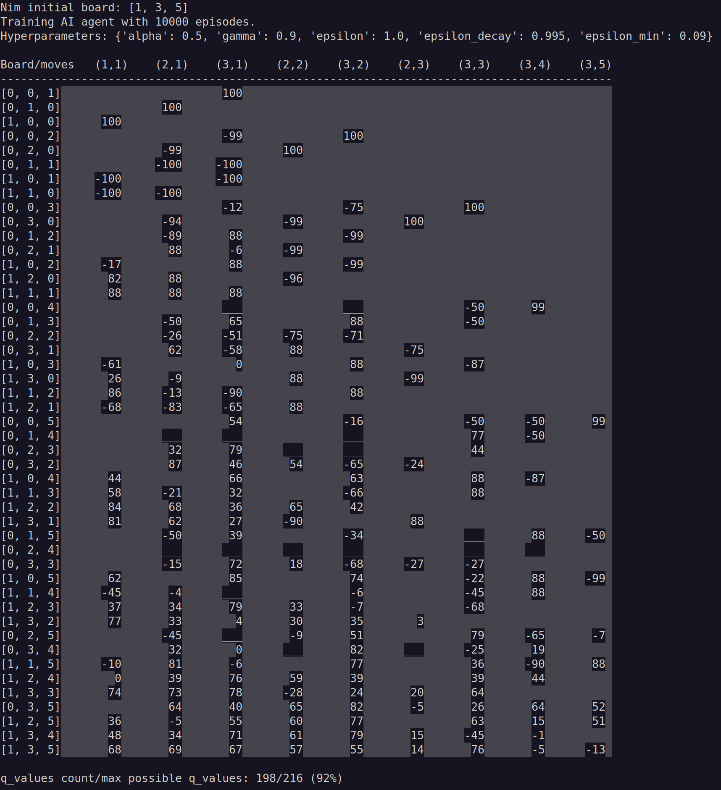

<link rel="stylesheet" href="css/styles.css">

# Nim Game Trainer: Q-Learning with AI Code Assistants


## Project Overview

This project is a Python implementation of the Q-learning algorithm for reinforcement learning, designed to train an AI to play Nim and allow human players to compete against it.

It is based on concepts from my 2024 HarvardX course ["CS50's Introduction to Artificial Intelligence with Python"](formacion_CS50AI.md) but has been fully restructured into an object-oriented design, with AI assistants implementing the code based on my design specifications.

Key aspects of the project:

- Implements Q-learning to train an AI for the Nim game.
- Features object-oriented design for clarity and scalability.
- Developed with AI code assistants (ChatGPT o3-mini-high, ChatGPT 4o, and DeepSeek) for generating and comparing solutions.
- Includes a visual analysis of the Q-table to explore how the algorithm learns optimal strategies.

## Why This Project?

Q-learning is an intriguing reinforcement learning technique—it enables an agent to discover optimal strategies in an unknown environment using rewards and penalties, driven by the Bellman equation. In many ways, it mirrors human learning: our choices shape our rewards.

Additionally, this project served as an opportunity to evaluate AI-generated code by comparing outputs from different AI models and testing their reliability in implementing my design.

## Nim Game Overview

Nim is a two-player strategy game in which players take turns removing tokens from heaps. On each turn, a player may take any number of tokens from a single heap. The player who removes the last token wins.

## Design Foundations

Core classes and their reinforcement learning (RL) roles:

- **Move** → Represents an RL action.
- **Board** → Represents an RL state.
- **Learner** → The Q-learning agent.
- **NimGame** → The RL environment.
- **NimTrainerPlayer** → Manages training and human vs. AI gameplay.

## UML Class Diagram

_(To be added.)_

## Design Challenges

Implementing Q-learning in a two-player game like Nim presents unique challenges:

* Delayed Rewards: Q-learning typically assumes immediate rewards, but in Nim, the reward (winning or losing) is only determined after the opponent’s move, not immediately after the agent’s action.

* Multi-Agent Dynamics: Since Q-learning is traditionally designed for single-agent environments, adapting it to a two-player setting like Nim required handling how both the agent’s and the opponent’s moves influence the state transitions and learning process.

These challenges required careful design to ensure the agent could learn effectively despite the game’s adversarial nature.


## Understanding the Q-Table

To analyze how the Q-table reflects the learning process:

- Given a board with heaps **(n₁, n₂, n₃, ...)**, the possible states are:
  **(n₁ + 1) × (n₂ + 1) × (n₃ + 1) × ...**
- The possible moves are:
  **n₁ × n₂ × n₃**

For a board setup like **[1, 3, 5]**, this results in **48 possible states** and **9 possible moves**, making it an ideal configuration for visualization and analysis.


## Generated Q-Table

Each row represents a possible game state, while each column corresponds to a possible move.




## Python code

```python
"""
Python module for a Nim game trainer and player using Q-Learning.

This script implements a Nim game environment where a player can train using
Q-Learning reinforcement learning by competing against a random opponent.
The objective of the game is to be the player who removes the last stone(s).

Authors:
    ChatGPT Plus, DeepSeek, JRM (January 2025)

License:
    GPL-3.0-or-later (GNU General Public License)
"""

import random
import pickle
import os
from typing import Dict, Tuple, List, Set


# ----------------------------
# Data Classes for Game State
# ----------------------------

class Move:
    """Represents a move in the Nim game.

    Attributes:
        heap_index (int): Index of the heap (0-indexed) from which stones are
            removed.
        stones (int): Number of stones to remove from the heap.
    """

    def __init__(self, heap_index: int, stones: int) -> None:
        """Initialize a Move instance.

        Args:
            heap_index (int): The index of the heap from which stones are to be
                removed.
            stones (int): The number of stones to remove.
        """
        self.heap_index: int = heap_index
        self.stones: int = stones

    def __repr__(self) -> str:
        """Return a string representation of the move.

        Returns:
            str: A human-readable string with heap_index adjusted to 1-based
                indexing.
        """
        return f"[{self.heap_index + 1}]->{self.stones}"


class Board:
    """Represents the board (state) for a game of Nim.

    Attributes:
        heaps (List[int]): A list of integers representing the number of stones
            in each heap.
    """

    def __init__(self, heaps: List[int]) -> None:
        """Initialize the board with the given heaps.

        Args:
            heaps (List[int]): A list of initial stone counts for each heap.
        """
        self.heaps: List[int] = heaps.copy()

    def apply_move(self, move: Move) -> None:
        """Apply a move to the board by removing stones from the specified heap.

        Args:
            move (Move): The move to apply.

        Raises:
            ValueError: If the move's heap index is out of range, if the number
                of stones to remove is not positive, or if there are insufficient
                stones in the heap.
        """
        if move.heap_index < 0 or move.heap_index >= len(self.heaps):
            raise ValueError("Invalid heap index in move.")
        if move.stones <= 0:
            raise ValueError("The number of stones to remove must be positive.")
        if self.heaps[move.heap_index] < move.stones:
            raise ValueError(
                "Not enough stones in the selected heap to remove."
            )
        self.heaps[move.heap_index] -= move.stones

    def get_valid_moves(self) -> List[Move]:
        """Generate all valid moves from the current board state.

        Returns:
            List[Move]: A list of all possible moves that can be made.
        """
        valid_moves: List[Move] = []
        for index, stone_count in enumerate(self.heaps):
            if stone_count > 0:
                for stones_to_remove in range(1, stone_count + 1):
                    valid_moves.append(
                        Move(heap_index=index, stones=stones_to_remove)
                    )
        return valid_moves

    def is_game_over(self) -> bool:
        """Check whether the game is over (i.e., all heaps are empty).

        Returns:
            bool: True if all heaps have zero stones, otherwise False.
        """
        return all(stones == 0 for stones in self.heaps)

    def __repr__(self) -> str:
        """Return a string representation of the board.

        Returns:
            str: A string that visually represents each heap and its stones.
        """
        board_str: str = ""
        for index, heap in enumerate(self.heaps):
            board_str += f"{index + 1}: {'*' * heap}\n"
        return board_str

    def show_stones_move(self, chosen_move: Move) -> str:
        """Generate a string representation of the board after a move.

        The stones removed by the move are shown with '·' and the remaining
        stones with '*'.

        Args:
            chosen_move (Move): The move that was applied.

        Returns:
            str: The board representation after the move.
        """
        result: str = "Board (* = stones; · = just removed stone)\n"
        for index, heap in enumerate(self.heaps):
            if index == chosen_move.heap_index:
                result += (
                    f"{index + 1}: {'*' * (heap - chosen_move.stones)}"
                    f"{'·' * chosen_move.stones}\n"
                )
            else:
                result += f"{index + 1}: {'*' * heap}\n"
        return result.strip()

    def copy(self) -> "Board":
        """Create a deep copy of the board.

        Returns:
            Board: A new instance of Board with the same heap configuration.
        """
        return Board(self.heaps.copy())

    def get_all_possible_states(self) -> List[Tuple[int, ...]]:
        """Generate all possible board states from the current configuration.

        The states are sorted by:
          1. Ascending total stones.
          2. Descending number of empty heaps.
          3. Lexicographical order.

        Returns:
            List[Tuple[int, ...]]: A sorted list of possible board states.
        """
        def _generate_states(heaps: List[int]) -> Set[Tuple[int, ...]]:
            states: Set[Tuple[int, ...]] = set()
            state: Tuple[int, ...] = tuple(heaps)
            states.add(state)
            for i, pile in enumerate(heaps):
                for remove in range(1, pile + 1):
                    new_heaps: List[int] = heaps.copy()
                    new_heaps[i] -= remove
                    new_state: Tuple[int, ...] = tuple(new_heaps)
                    if new_state not in states:
                        states.update(_generate_states(new_heaps))
            return states

        all_states: Set[Tuple[int, ...]] = _generate_states(self.heaps)
        sorted_states: List[Tuple[int, ...]] = sorted(
            all_states,
            key=lambda state: (
                sum(state),
                -sum(1 for h in state if h == 0),
                state
            )
        )
        return sorted_states


# ----------------------------
# Q-Learning Agent
# ----------------------------

class Learner:
    """Q-learning agent for the Nim game.

    Attributes:
        alpha (float): Learning rate.
        gamma (float): Discount factor.
        epsilon (float): Exploration rate.
        epsilon_decay (float): Decay rate for epsilon.
        epsilon_min (float): Minimum exploration rate.
        q_table (Dict[Tuple[Tuple[int, ...], int, int], float]): Mapping from
            (state, move) to Q-value.
    """

    def __init__(
        self,
        alpha: float = 0.5,
        gamma: float = 0.9,
        epsilon: float = 1.0,
        epsilon_decay: float = 0.99,
        epsilon_min: float = 0.01
    ) -> None:
        """Initialize the Learner with Q-learning parameters.

        Args:
            alpha (float): Learning rate.
            gamma (float): Discount factor.
            epsilon (float): Initial exploration rate.
            epsilon_decay (float): Factor to decay epsilon per iteration.
            epsilon_min (float): Minimum allowable exploration rate.
        """
        self.alpha: float = alpha
        self.gamma: float = gamma
        self.epsilon: float = epsilon
        self.epsilon_decay: float = epsilon_decay
        self.epsilon_min: float = epsilon_min
        self.q_table: Dict[Tuple[Tuple[int, ...], int, int], float] = {}

    def _get_key(self, board: Board, move: Move) -> Tuple[Tuple[int, ...], int, int]:
        """Generate a unique key for a given board and move.

        Args:
            board (Board): The current game board.
            move (Move): The move to be made.

        Returns:
            Tuple[Tuple[int, ...], int, int]: A tuple used as a key in the Q-table.
        """
        return (tuple(board.heaps), move.heap_index, move.stones)

    def get_q_value(self, board: Board, move: Move) -> float:
        """Retrieve the Q-value for a specific board state and move.

        Args:
            board (Board): The current board state.
            move (Move): The move to evaluate.

        Returns:
            float: The stored Q-value, or 0.0 if it has not been set.
        """
        key: Tuple[Tuple[int, ...], int, int] = self._get_key(board, move)
        return self.q_table.get(key, 0.0)

    def set_q_value(self, board: Board, move: Move, value: float) -> None:
        """Set the Q-value for a specific board state and move.

        Args:
            board (Board): The current board state.
            move (Move): The move to update.
            value (float): The new Q-value.
        """
        key: Tuple[Tuple[int, ...], int, int] = self._get_key(board, move)
        self.q_table[key] = value

    def choose_move(self, board: Board, train_mode: bool = True) -> Move:
        """Select a move using an epsilon-greedy strategy.

        Args:
            board (Board): The current board state.
            train_mode (bool): If True, use exploration; otherwise, choose the best
                known move.

        Returns:
            Move: The move selected.

        Raises:
            ValueError: If there are no valid moves available.
        """
        valid_moves: List[Move] = board.get_valid_moves()
        if not valid_moves:
            raise ValueError("No valid moves available on the board.")
        if train_mode and random.random() < self.epsilon:
            return random.choice(valid_moves)

        best_value: float = float("-inf")
        best_moves: List[Move] = []
        for move in valid_moves:
            q_value: float = self.get_q_value(board, move)
            if q_value > best_value:
                best_value = q_value
                best_moves = [move]
            elif q_value == best_value:
                best_moves.append(move)
        return random.choice(best_moves)

    def update_q_value(
        self, board: Board, move: Move, reward: float, next_board: Board
    ) -> None:
        """Update the Q-value using the Q-learning update rule.

        Args:
            board (Board): The board state before the move.
            move (Move): The move that was made.
            reward (float): The reward received after making the move.
            next_board (Board): The board state following the move.
        """
        current_q: float = self.get_q_value(board, move)
        if next_board.is_game_over():
            max_future_q: float = 0.0
        else:
            valid_moves: List[Move] = next_board.get_valid_moves()
            max_future_q = max(
                (self.get_q_value(next_board, next_move)
                 for next_move in valid_moves),
                default=0.0
            )
        new_q: float = current_q + self.alpha * (
            reward + self.gamma * max_future_q - current_q
        )
        self.set_q_value(board, move, new_q)

    def decay_epsilon(self) -> None:
        """Decay the exploration rate epsilon to gradually reduce exploration."""
        self.epsilon = max(self.epsilon_min, self.epsilon * self.epsilon_decay)

    def save_q_table(self, filename: str) -> None:
        """Save the current Q-table to a file.

        Args:
            filename (str): The file path where the Q-table should be saved.

        Raises:
            IOError: If there is an issue writing to the file.
        """
        try:
            with open(filename, "wb") as file:
                pickle.dump(self.q_table, file)
        except OSError as e:
            raise IOError(f"Failed to save Q-table to {filename}: {e}") from e

    def load_q_table(self, filename: str) -> None:
        """Load the Q-table from a file.

        Args:
            filename (str): The file path from which to load the Q-table.

        Raises:
            IOError: If there is an issue reading from the file.
        """
        try:
            with open(filename, "rb") as file:
                self.q_table = pickle.load(file)
        except OSError as e:
            raise IOError(f"Failed to load Q-table from {filename}: {e}") from e

    def show_q_table(self, initial_board: List[int]) -> None:
        """Print a formatted table of the Q-values.

        Args:
            initial_board (List[int]): The initial configuration of heaps used to
                generate possible states.
        """
        brick: str = "░"
        q_value_count: int = 0
        missing_q_values_count: int = 0
        board_obj: Board = Board(initial_board)
        all_board_states: List[Tuple[int, ...]] = (
            board_obj.get_all_possible_states()[1:]
        )
        num_heaps: int = len(initial_board)
        moves_set: Set[Tuple[int, int]] = {
            (heap_idx, stones)
            for heap_idx in range(num_heaps)
            for stones in range(1, initial_board[heap_idx] + 1)
        }
        moves: List[Tuple[int, int]] = sorted(
            moves_set, key=lambda m: (m[1], m[0])
        )
        header: str = (
            f"{'Board/moves':<11}"
            + " ".join(f"{f'({m[0]+1},{m[1]})':>8}" for m in moves)
        )
        print(header)
        print("-" * len(header))
        for board in all_board_states:
            board_str: str = str(list(board))
            row: str = f"{board_str:<9}"
            for heap_idx, stones in moves:
                if board[heap_idx] < stones:
                    cell: str = brick
                else:
                    key: Tuple[Tuple[int, ...], int, int] = (
                        board, heap_idx, stones
                    )
                    if key in self.q_table:
                        q_val: float = self.q_table[key]
                        q_value_count += 1
                        cell = "0" if q_val == 0 else f"{int(q_val * 100)}"
                    else:
                        cell = "___"
                        missing_q_values_count += 1
                row += f"{cell:>9}".replace(" ", brick)
            print(row + brick)
        total: int = q_value_count + missing_q_values_count
        print(
            f"\nq_values count/max possible q_values: {q_value_count}/"
            f"{total} ({100 * q_value_count / total:.0f}%)\n"
        )


# ----------------------------
# Game Environment
# ----------------------------

class NimGame:
    """Represents the game environment for Nim.

    Attributes:
        initial_heaps (List[int]): The initial configuration of heaps.
        board (Board): The current state of the board.
        step_penalty (float): The penalty applied for each non-winning move.
    """
    WIN_REWARD: float = 1.0  # Class-level constant for the winning reward.

    def __init__(self, initial_heaps: List[int], step_penalty: float = 0.01) -> None:
        """Initialize the Nim game environment.

        Args:
            initial_heaps (List[int]): A list of integers representing the initial
                stones in each heap.
            step_penalty (float, optional): The penalty for non-winning moves.
                Defaults to 0.01.
        """
        self.initial_heaps: List[int] = initial_heaps.copy()
        self.board: Board = Board(initial_heaps)
        self.step_penalty: float = step_penalty

    def get_valid_moves(self) -> List[Move]:
        """Retrieve all valid moves for the current board state.

        Returns:
            List[Move]: A list of valid moves.
        """
        return self.board.get_valid_moves()

    def apply_move(self, move: Move) -> None:
        """Apply a move to the current board.

        Args:
            move (Move): The move to apply.
        """
        self.board.apply_move(move)

    def is_game_over(self) -> bool:
        """Check whether the game is over.

        Returns:
            bool: True if the game has ended (all heaps are empty), otherwise
                False.
        """
        return self.board.is_game_over()

    def reset(self) -> None:
        """Reset the board to its initial configuration."""
        self.board = Board(self.initial_heaps)

    def step(self, move: Move) -> Tuple[Board, float, bool]:
        """Apply a move and obtain the next state, reward, and game-over flag.

        Args:
            move (Move): The move to apply.

        Returns:
            Tuple[Board, float, bool]: A tuple containing:
                - Board: The new board state (deep copy).
                - float: The reward obtained (WIN_REWARD if game is won;
                  otherwise negative step_penalty).
                - bool: True if the game is over, False otherwise.
        """
        self.board.apply_move(move)
        game_over: bool = self.board.is_game_over()
        reward: float = self.WIN_REWARD if game_over else -self.step_penalty
        return self.board.copy(), reward, game_over


# ----------------------------
# Trainer and Player (UI)
# ----------------------------

class NimTrainerPlayer:
    """Combines the Nim game with Q-learning training and provides a human-play
    interface.

    Attributes:
        game (NimGame): The game environment.
        learner (Learner): The Q-learning agent.
        q_table_filename (str): The file path for saving/loading the Q-table.
    """

    def __init__(self, game: NimGame, learner: Learner,
                 q_table_filename: str) -> None:
        """Initialize the trainer/player with the game, learner, and Q-table file.

        Args:
            game (NimGame): The Nim game environment.
            learner (Learner): The Q-learning agent.
            q_table_filename (str): The filename for saving or loading the Q-table.
        """
        self.game: NimGame = game
        self.learner: Learner = learner
        self.q_table_filename: str = q_table_filename

    def load_q_table(self) -> bool:
        """Load the Q-table from the file if it exists.

        Returns:
            bool: True if the Q-table was successfully loaded, False otherwise.
        """
        if not self.q_table_filename or not os.path.exists(
            self.q_table_filename
        ):
            return False
        try:
            self.learner.load_q_table(self.q_table_filename)
            print(
                f"Loaded Q-table from '{self.q_table_filename}'. "
                "Skipping training."
            )
            return True
        except IOError as e:
            print(
                f"Could not load Q-table from '{self.q_table_filename}': {e}. "
                "Proceeding with training."
            )
            return False

    def save_q_table(self) -> None:
        """Save the Q-table to the specified file."""
        if not self.q_table_filename:
            return
        self.learner.save_q_table(self.q_table_filename)
        print(f"Q-table saved to '{self.q_table_filename}'.")

    def _train_episode(self) -> None:
        """Execute one training episode using an agent vs. random opponent strategy."""
        self.game.reset()
        agent_goes_first: bool = random.choice([True, False])
        while not self.game.is_game_over():
            if agent_goes_first:
                board_state: Board = self.game.board.copy()
                agent_move: Move = self.learner.choose_move(
                    board_state, train_mode=True
                )
                next_board, reward, game_over = self.game.step(agent_move)
                if game_over:
                    self.learner.update_q_value(
                        board_state, agent_move, reward, next_board
                    )
                    break
                # Opponent move (randomly chosen)
                opponent_move: Move = random.choice(
                    self.game.get_valid_moves()
                )
                next_board_after_opp, _, game_over = self.game.step(
                    opponent_move
                )
                if game_over:
                    self.learner.update_q_value(
                        board_state, agent_move, -1.0, next_board_after_opp
                    )
                    break
                self.learner.update_q_value(
                    board_state, agent_move, reward, next_board_after_opp
                )
            else:
                # Opponent goes first
                opponent_move = random.choice(self.game.get_valid_moves())
                _, _, game_over = self.game.step(opponent_move)
                if game_over:
                    break
                board_state = self.game.board.copy()
                agent_move = self.learner.choose_move(
                    board_state, train_mode=True
                )
                next_board, reward, game_over = self.game.step(agent_move)
                if game_over:
                    self.learner.update_q_value(
                        board_state, agent_move, reward, next_board
                    )
                    break
                opponent_move = random.choice(self.game.get_valid_moves())
                next_board_after_opp, _, game_over = self.game.step(
                    opponent_move
                )
                if game_over:
                    self.learner.update_q_value(
                        board_state, agent_move, -1.0, next_board_after_opp
                    )
                    break
                self.learner.update_q_value(
                    board_state, agent_move, reward, next_board_after_opp
                )
        self.learner.decay_epsilon()

    def train(self, episodes: int = 10000) -> None:
        """Train the Q-learning agent for a specified number of episodes.

        Args:
            episodes (int, optional): Number of training episodes.
                Defaults to 10000.
        """
        if self.load_q_table():
            return
        for _ in range(episodes):
            self._train_episode()
        self.save_q_table()

    def get_human_move(self) -> Move:
        """Prompt the human player to select a move.

        Returns:
            Move: The move chosen by the human player.
        """
        valid_moves: List[Move] = self.game.get_valid_moves()
        print(50 * "-")
        print("Your turn: Choose a move from the following options:")
        for idx, move in enumerate(valid_moves):
            print(f"  {idx}: {move}")
        while True:
            try:
                choice: int = int(input(
                    "Enter the number of your chosen move: "
                ))
                if 0 <= choice < len(valid_moves):
                    return valid_moves[choice]
                else:
                    print("Invalid choice. Try again.")
            except ValueError:
                print("Invalid input. Please enter an integer.")

    def play_against_human(self) -> None:
        """Allow a human player to play against the trained AI agent."""
        if (not self.learner.q_table and self.q_table_filename and
                os.path.exists(self.q_table_filename)):
            self.load_q_table()
        human_turn: bool = input("Do you want to go first? (y/n): ").strip(
        ).lower() == "y"
        self.game.reset()
        print(f"\nInitial Nim board:\n{self.game.board}")
        while not self.game.is_game_over():
            if human_turn:
                chosen_move: Move = self.get_human_move()
                # Show the board state after the human move.
                print(self.game.board.show_stones_move(chosen_move))
                self.game.apply_move(chosen_move)
                if self.game.is_game_over():
                    print("Congratulations! You win!")
                    return
            else:
                chosen_move = self.learner.choose_move(
                    self.game.board, train_mode=False
                )
                input("Press Enter to see AI move...")
                print(50 * "-")
                print(f"Nim AI moves: {chosen_move}\n")
                print(self.game.board.show_stones_move(chosen_move))
                self.game.apply_move(chosen_move)
                if self.game.is_game_over():
                    print("Agent wins!")
                    return
            human_turn = not human_turn


# ----------------------------
# Main Execution
# ----------------------------

def main() -> None:
    """Main function to initialize and run the Nim game training and human play.

    This function sets up the game environment, configures the Q-learning parameters,
    trains the AI agent, displays the Q-table, and finally allows a human to play
    against the agent.
    """
    initial_heaps: List[int] = [1, 3, 5]
    hyperparameters: Dict[str, float] = {
        "alpha": 0.5,
        "gamma": 0.9,
        "epsilon": 1.0,
        "epsilon_decay": 0.995,
        "epsilon_min": 0.09,
    }
    step_penalty: float = 0.01
    training_episodes: int = 10000

    print(f"Nim initial board: {initial_heaps}")
    print(f"Training AI agent with {training_episodes} episodes.")
    print(f"Hyperparameters: {hyperparameters}\n")

    game: NimGame = NimGame(initial_heaps, step_penalty)
    learner: Learner = Learner(
        alpha=hyperparameters["alpha"],
        gamma=hyperparameters["gamma"],
        epsilon=hyperparameters["epsilon"],
        epsilon_decay=hyperparameters["epsilon_decay"],
        epsilon_min=hyperparameters["epsilon_min"],
    )
    trainer_player: NimTrainerPlayer = NimTrainerPlayer(
        game, learner, q_table_filename=""
    )
    trainer_player.train(training_episodes)
    learner.show_q_table(initial_heaps)
    print("\nNow, let's play against the trained agent!")
    trainer_player.play_against_human()


if __name__ == "__main__":
    main()

